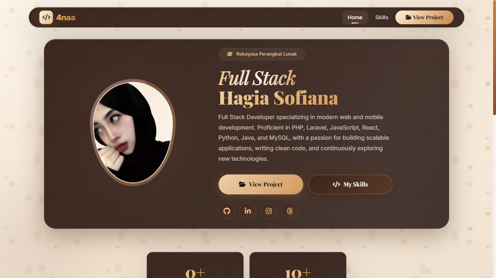

# Hagia Sofiana Portfolio

A full-stack portfolio management system designed to simplify content management while delivering a fast and responsive portfolio website.

The project consists of three independent applications:

* **Portfolio Frontend** – a public-facing React application for showcasing projects and professional information.
* **Admin Dashboard** – a private content management interface used to manage portfolio content.
* **Backend API** – a Node.js and Express service responsible for data management, file uploads, and automatic JSON generation.

Instead of serving portfolio data directly from the database, the backend generates a static JSON file whenever content is updated. The frontend consumes this generated data, providing a lightweight and efficient browsing experience.

> **Live Website**
> https://hagia-sofiana-portofolio.vercel.app

---

# Preview

> Replace this section with a screenshot of the homepage.

```text
preview.png
```

```markdown

```

---

# Architecture

```
                    Admin Dashboard
                           │
                           │
                    Manage Portfolio
                           │
                           ▼
                 Node.js / Express API
                           │
                           ▼
                        MySQL Database
                           │
                           ▼
             Automatic JSON Generation
                           │
                           ▼
                React Portfolio Frontend
                           │
                           ▼
                        Website Visitors
```

This architecture separates content management from the presentation layer, allowing the portfolio website to remain fast while keeping portfolio data easy to maintain.

---

# Key Features

### Public Portfolio

* Responsive portfolio website built with React
* Modern user interface with a custom design
* Project showcase with category filtering
* Recent project section
* Technology tags for each project
* GitHub and live demo links
* Social media integration

### Admin Dashboard

* Manage portfolio projects through a dedicated dashboard
* Create, edit, and delete project entries
* Upload and replace project images
* Assign project categories and technologies
* Automatic synchronization after every update

### Backend

* REST API built with Express
* MySQL database integration
* Image upload management using Multer
* Automatic generation of `data.json`
* Public API for portfolio content

---

# Technology Stack

## Frontend

* React
* React Router
* Bootstrap 5
* JavaScript (ES6+)
* HTML5
* CSS3

## Backend

* Node.js
* Express.js
* MySQL
* Multer
* CORS

## Development Tools

* Git
* GitHub
* npm
* Vercel

---

# Project Structure

```
Portofolio/
│
├── admin/
│   ├── src/
│   ├── public/
│   └── package.json
│
├── backend/
│   ├── server.js
│   ├── uploads/
│   └── package.json
│
├── frontend/
│   ├── public/
│   │   └── assets/
│   ├── src/
│   └── package.json
│
└── README.md
```

---

# How It Works

The portfolio content is managed through the Admin Dashboard.

Whenever a project is created, updated, or removed:

1. The Admin Dashboard sends the request to the backend API.
2. The backend stores the data in the MySQL database.
3. The backend regenerates the portfolio JSON file.
4. The React frontend automatically uses the updated JSON data.
5. Visitors immediately see the latest portfolio content without rebuilding the frontend.

---

# Getting Started

## Prerequisites

Before running the project, make sure you have:

* Node.js
* npm
* MySQL Server

---

## Clone Repository

```bash
git clone https://github.com/ann4yaa/Portofolio.git
```

---

## Install Dependencies

### Backend

```bash
cd backend
npm install
```

### Admin Dashboard

```bash
cd admin
npm install
```

### Frontend

```bash
cd frontend
npm install
```

---

## Start Development

### Backend

```bash
cd backend
npm run dev
```

### Admin Dashboard

```bash
cd admin
npm start
```

### Frontend

```bash
cd frontend
npm start
```

---

# Future Improvements

The project continues to evolve. Planned improvements include:

* Authentication for the admin dashboard
* Environment variable configuration
* Backend architecture refactoring
* Improved API validation
* Better error handling
* Automated database migration
* Unit and integration testing

---

# About This Project

This project was developed as a personal portfolio and learning project to demonstrate practical experience in building full-stack web applications.

Beyond presenting projects visually, the main objective was to design a maintainable content management workflow where portfolio data can be updated without modifying the frontend application directly.

---

# Author

**Hagia Sofiana**

GitHub
https://github.com/ann4yaa

LinkedIn
https://linkedin.com/in/hagia-sofiana

Portfolio
https://hagia-sofiana-portofolio.vercel.app
